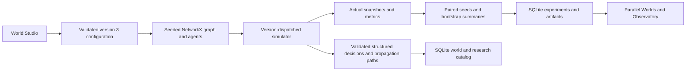

# ButterflyLab architecture

Phase 2C adds `exploration.py` (versioned scans/validation), `jobs.py` (durable bounded tasks) and `trajectories.py` (summary/chunk/archive format 1). Experiment schema 1 and original engine versions remain compatible; job/scan catalogs use separate SQLite files. See [storage, jobs and acceptance](docs/PHASE2C.md).

## Compatibility boundary

`backend.simulation.initial_world/simulate` dispatch only explicitly versioned
`SocialConfig` to `social-1.0.0`. Dictionaries without `engine` retain the
original `0.2.0` rules. Unknown versions fail public configuration validation.
Saved experiments retain their engine; replay rejects a mismatched engine or
recorded dependency fingerprint. Existing database rows are not rewritten.

## Data flow

`research.py` keeps matched comparisons and the original bounded resource
candidate schedule; candidates use discovery seeds, the winner uses disjoint
validation seeds. `studies.py` runs full Cartesian grids or on/off ablations.
All cells and per-seed effects are retained, including zero effects.

## Persistence and API

- `data/experiments.sqlite3`: schema 1, experiments metadata plus artifacts
  containing metrics and full simulation payload. Runs are queued on one worker;
  persisted progress counts real completed evaluations. Interrupted runs are
  marked failed on restart, not silently resumed.
- `data/worlds.sqlite3`: independent schema 1, immutable named configurations,
  optional parent IDs, studies, and decision tapes. Both databases check
  `PRAGMA user_version` and refuse newer schemas. SQLite files are ignored.
- Existing experiment CRUD/export/reproduce APIs remain available.
- `POST /api/world/preview`, `/api/worlds`, `GET /api/worlds/{id}`:
  validate, create real networks, save and load configurations.
- `GET /api/scenarios`: editable fragile/cascade presets.
- `POST /api/studies`: synchronous bounded study; at most 1200 grid seed cells
  (two simulations per cell). There is a busy state, no invented progress.
- `POST /api/decisions/demo`: explicit provider configuration, validated actions,
  persistent sanitized tape, exact tape replay check.
- `GET /api/environment`: Python and dependency fingerprint.

Normal browsing uses summary data and bounded lazy seed/round trajectory chunks.
Server-prepared ZIP/gzip archives retain complete data and checksums. Legacy full
JSON responses remain available and cost more memory; historical payloads are retained.

## Frontend

React/Vite/Recharts and the incumbent dark console remain. World Studio adds
network-specific inputs and actual graph preview. Living World inspection is
integrated into the existing synchronized A/B networks and agent popovers,
rather than a separate route. Social nodes use engine-generated positions;
blue borders indicate informed agents, blue edges identify recorded
transmissions in the selected round. Removed edges disappear. The shared
timeline, event log, seed selector and legacy network animation remain.

## Provider boundary

`Decision` accepts strict booleans, an optional integer neighbor target and a
short reason; no arbitrary state mutation. Invalid proposals/timeouts/budget
exhaustion fall back to the rule score. Donation and propagation are then
validated and executed by the engine. The key comes only from server
`BUTTERFLYLAB_LLM_KEY`, is not a public model field, and is not persisted.
External calls use the opt-in, consented, budgeted `/api/llm/pilots` endpoint;
the legacy decision demo rejects external calls. Phase 2D verified exactly one
connectivity request; real multi-seed research remains incomplete. Release CI
and v0.1.0 acceptance make no paid requests.
