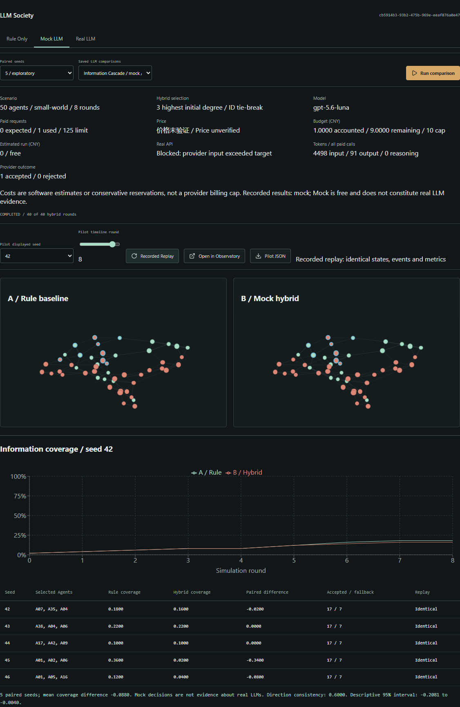
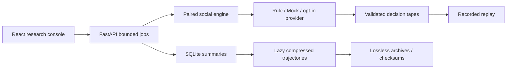

# ButterflyLab

**What if one tiny change could reshape an entire artificial society?**

An open-source multi-agent research laboratory for simulating parallel societies,
discovering sensitive interventions, and exploring emergent behavior through reproducible experiments.


[](LICENSE)
[](https://github.com/Qqqq5910/ButterflyLab/actions/workflows/ci.yml)

English | [中文](README.zh-CN.md) · [Quick Start](#quick-start) ·
[Research](#research-highlights) · [Methods](RESEARCH.md) · [Contribute](CONTRIBUTING.md)


## Explore Freely

Rule and Mock need **no API key**. Every curve comes from backend simulation.
ButterflyLab studies its synthetic model; it does not predict real societies.

| Workflow | Experience |
| --- | --- |
| **01 — Create a World** | Edit social rules, resources and ER, WS or BA networks. |
| **02 — Watch It Evolve** | Inspect actual cooperation, trust and transmission. |
| **03 — Change One Thing** | Apply resource, opinion or information interventions. |
| **04 — Compare Parallel Worlds** | Match initial states and seeds; inspect paired effects. |
| **05 — Discover Sensitive Conditions** | Scan parameters, refine candidate regions and validate on held-out seeds. |
| **06 — Reproduce the Experiment** | Save configurations, metrics and full trajectories; verify recorded replay. |


## Quick Start

Install **Python 3.14.6** and **Node.js 24.19.0**. Dependency versions are locked.

```powershell
git clone https://github.com/Qqqq5910/ButterflyLab.git
cd ButterflyLab
powershell -ExecutionPolicy Bypass -File scripts/free-demo.ps1
```

Open `http://127.0.0.1:5173/` locally. This is a **Local Demo**, not a hosted service.
Occupied ports? Append `-ApiPort 8004 -WebPort 5176`. The Windows launcher reuses
a valid frontend install and forces real model calls off by default.

Click **Run Demo** in World Studio to run a free 50-Agent, five-seed Information Cascade baseline.
Run the baseline, apply a local information intervention, run five paired seeds,
inspect coverage and export Summary JSON. To change the *global* transmission
probability, use Sensitivity Lab to scan transmission; a local intervention differs.

Linux/macOS: `sh scripts/free-demo.sh` with the same runtimes. These platforms
have not been verified locally. Manual startup:

```sh
python3.14 -m venv .venv
.venv/bin/python -m pip install -r backend/requirements.lock.txt
.venv/bin/python -m uvicorn backend.api:app --host 127.0.0.1 --port 8001
# In a second terminal:
cd frontend
npm ci
npm run dev -- --host 127.0.0.1
```

API health: `http://127.0.0.1:8001/api/health`; API docs: `http://127.0.0.1:8001/docs`.
Bind both services to loopback: the application has no authentication.

## Research Highlights

Increasing transmission probability from **0.1 to 0.2** increased mean final
information coverage by **0.246–0.428** across nine rule-mode validation settings:
30 independent paired seeds, three networks and populations 30, 50, 100.
[Compact evidence](examples/transmission-validation.json) retains configurations,
seeds, per-seed results and descriptive intervals. [Methods and measurements](docs/PHASE2C.md).

This supports a **candidate finite-size high-sensitivity region**, not a phase
transition. Network density is approximately matched; topology comparisons remain
confounded. Discovery and validation seeds are disjoint. No multiplicity correction
or real-world extrapolation is claimed. Tiny resource changes did not inevitably
amplify: resource −1 yielded zero mean cooperation change in the tested setting.

## LLM Support

| Mode | Verified status |
| --- | --- |
| Rule | Free paired simulations and deterministic reproduction. |
| Mock LLM | Free structured decisions, saved comparisons and recorded replay. |
| OpenAI-compatible provider | Backend HTTPS adapter and action validation implemented. |
| TokenHub `gpt-5.6-luna` | Exactly one real connectivity request accepted. |
| Real multi-seed LLM society study | **Not completed**: account-effective price unverified and reported input above target. |



Recorded replay uses stored decisions and makes no live model calls. The historical
connectivity action is an integration fixture, **not a completed LLM society experiment**.
[Full pilot report](docs/LLM_PILOT.md).

Set backend process variables from [.env.example](.env.example); the template is
not loaded automatically. Never place keys in `VITE_*` variables. The v0.1 pilot
fixes model/route and protocol; arbitrary model substitution is not supported.
Real mode needs server opt-in, verified account rates and UI consent. Software
reservations are not provider invoices or provider-enforced spending caps.

## Architecture and Data



`backend/`: engines, metrics, jobs, persistence, research and tests.
`frontend/`: React/Vite console and browser acceptance scripts.
`scripts/`: launchers. `examples/`: small sanitized evidence.
`docs/`: methods, design and release evidence. Local `data/` and `output/` are ignored.

A/B worlds share initial states and addressable random streams. Results report
B−A, sample SD, direction consistency and seeded percentile-bootstrap intervals.
Small samples are exploratory. Strict rule/tape equality requires the same engine
and runtime/dependency fingerprint; fresh external LLM calls are not deterministic.

Summary JSON carries configurations, seeds, metrics and statistics. Full ZIP/gzip
archives preserve states/events with format versions and checksums. Bounded
seed/round chunks load on demand; old experiment formats remain readable.
See [Architecture](ARCHITECTURE.md), [Methods](RESEARCH.md), [Experiments](EXPERIMENTS.md)
and [Data and licenses](docs/DATA_AND_LICENSES.md).

## Verification and Limits

```powershell
.venv\Scripts\python.exe -m pytest backend -q
.venv\Scripts\python.exe -m backend.verify_pilot
.venv\Scripts\python.exe -m backend.release_scan
cd frontend
npm run build
```

Local release baseline: **98 backend tests passed**; frontend build passed.
CI runs Rule/Mock only, with no paid keys. Bundle-size and dependency deprecation
warnings are documented. Population cap is 100; density matching is approximate;
browser-process memory has not been benchmarked. [Release report](docs/RELEASE_V0.1.0_REPORT.md).

## Roadmap

Real LLM society experiments after pricing/input verification; model comparisons;
Causal Trace; larger networks; multiple-comparison correction; stricter density
matching; browser memory benchmarks; archive management; a future hosted demo.
These are future work.

## Contribute and License

[Contributor guide](CONTRIBUTING.md) · [Security](SECURITY.md) ·
[Changelog](CHANGELOG.md) · [Design](DESIGN.md).
Project code is [MIT](LICENSE). Third-party dependencies retain their own licenses;
local credentials and private trajectories are not distributed.
