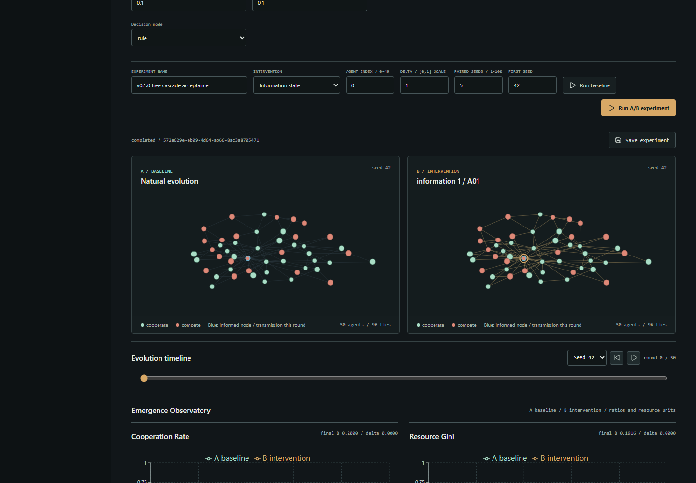
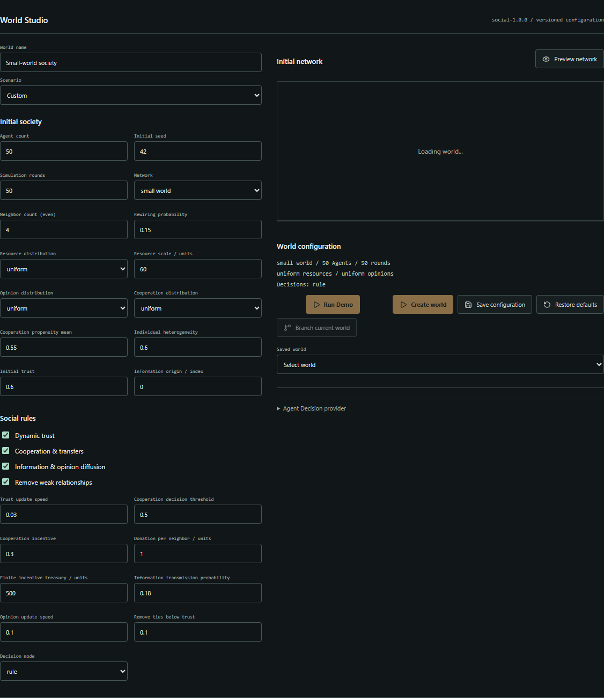
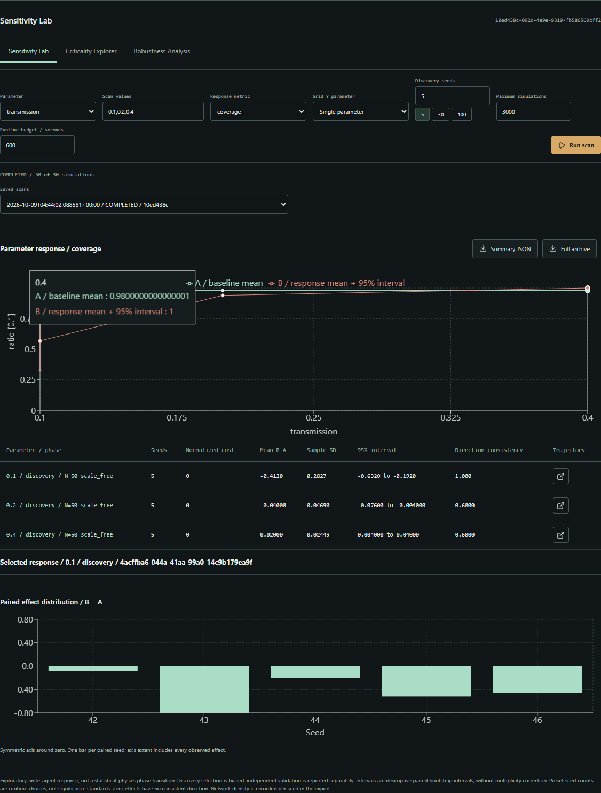

# ButterflyLab

**如果只改变一个微小条件，整个虚拟社会会走向怎样不同的未来？**

开源多智能体研究实验室：模拟平行社会，探索敏感干预，以可复现的实验研究群体涌现。

[English](README.md) | 中文 · [快速启动](#快速启动) · [方法](RESEARCH.md)



免费 Rule / Mock 无需 API Key。曲线由后端真实模拟计算，平台不预测现实社会。

## 从世界到实验

1. **创建世界**：配置 Agent、资源、社会规则和 ER / WS / BA 网络。
2. **观察演化**：检查合作、动态信任和信息传播。
3. **改变一个条件**：施加资源、观点或信息干预。
4. **比较平行世界**：相同初始状态、配对种子，查看 B−A 效应。
5. **探索敏感条件**：单轴/双轴扫描、候选区域加密、独立种子验证。
6. **复现实验**：保存配置与完整轨迹，导出摘要或无损归档，验证记录回放。




## 快速启动

安装 Python **3.14.6** 和 Node.js **24.19.0**，然后在 PowerShell 执行：

```powershell
git clone https://github.com/Qqqq5910/ButterflyLab.git
cd ButterflyLab
powershell -ExecutionPolicy Bypass -File scripts/free-demo.ps1
```

打开本机 `http://127.0.0.1:5173/`。这是本地 Demo，尚无公网在线服务。
端口占用时附加 `-ApiPort 8004 -WebPort 5176`。依赖完整时复用前端安装，默认禁用付费模型。

World Studio 点击 **Run Demo**，运行免费的 50 Agent、5 种子 Information Cascade 基线。
运行五个配对种子、施加局部信息干预，查看传播覆盖率和 A/B 网络。
调整全局传播概率请进入 Sensitivity Lab 扫描 transmission；局部干预含义不同。
保存实验、刷新恢复并导出 Summary JSON / Full archive。

Linux/macOS 可用 `sh scripts/free-demo.sh`，但未在本机验证这些平台。
手动启动、端口与 API 文档见 [英文说明](README.md#quick-start)。
仅监听本机，应用不含身份认证。

## 真实规则研究

传播概率从 **0.1 提高到 0.2**，在 30 个独立配对种子、三种网络与三种规模
构成的九组验证中，最终传播覆盖率平均增加 **0.246–0.428**。
[小型公开证据](examples/transmission-validation.json) 包含配置、种子、每种子结果与不确定性。
[完整方法及测量](docs/PHASE2C.md)。

这是有限规模候选高敏感区域，不是严格相变证明。网络密度仅近似匹配，
拓扑比较仍有混杂因素，未实施多重比较校正，不可外推现实社会。
微小干预也可能不产生宏观差异：已测资源 −1 场景平均合作率差值为零。

## LLM 状态

Rule 和 Mock 已验证；OpenAI-compatible 后端接口与动作校验已实现。
TokenHub `gpt-5.6-luna` 仅完成 **一次真实连通性调用**。
账户有效价格未核实、报告输入超过目标，真实 3 Agent / 5 种子社会研究 **尚未完成**。
不得把 Mock 结果或连通性成功视作真实 LLM 群体研究证据。

记录回放不调用 API。单次历史动作仅是集成样例，不是完整真实社会实验。
[LLM 报告](docs/LLM_PILOT.md)。配置使用后端环境变量，见 [.env.example](.env.example)，
模板不会自动加载。密钥不得进入前端或 Git。v0.1 协议固定模型，不支持任意替换。

## 方法、数据与工程

React/Vite 前端、FastAPI 后端、SQLite 摘要、分块轨迹和 ZIP/gzip 无损归档。
A/B 共用初始状态和可寻址随机流；报告配对差值、样本标准差、方向一致性与 bootstrap 区间。
小样本仅供探索。精确规则/动作回放要求相同引擎、运行时与依赖，模型新调用不保证确定性。

`backend/` 为引擎、存储、任务、研究和测试；`frontend/` 为界面与浏览器脚本；
`examples/` 仅公开小型脱敏证据；`data/`、`output/`、密钥与缓存不发布。

本地发布基线 **98 项后端测试通过**，前端构建通过。CI 仅 Rule/Mock，禁止付费调用。
上限 100 Agent，密度控制近似，未完成浏览器进程内存基准。

[架构](ARCHITECTURE.md) · [指标公式](RESEARCH.md) · [实验](EXPERIMENTS.md) ·
[设计](DESIGN.md) · [发布报告](docs/RELEASE_V0.1.0_REPORT.md)

## 后续与贡献

未来计划：价格/输入问题解决后的真实 LLM 社会实验、模型对比、Causal Trace、
大规模网络、多重比较校正、严格密度匹配、浏览器内存基准、归档管理与公网 Demo。
以上不代表已完成。

[贡献指南](CONTRIBUTING.md) · [安全政策](SECURITY.md) · [更新日志](CHANGELOG.md)。
项目代码采用 [MIT](LICENSE)，第三方许可与数据来源见 [说明](docs/DATA_AND_LICENSES.md)。
