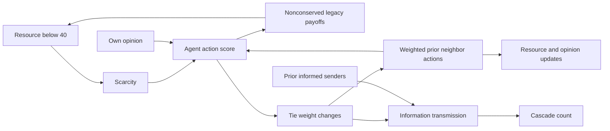

# Mechanism audit: legacy 0.2.0

Executed 2026-10-09 with the original engine, 50 agents, 50 rounds, paired
seeds 42-71. Reproduce with `.venv\Scripts\python -m backend.audit_mechanisms`.
Full per-cell seed effects, SD and bootstrap intervals are saved to
`output/research/legacy-sensitivity.json`. All 15 predeclared cells are retained.

## Actual legacy dependencies

There is no arrow from informed state to cooperation or opinion: the legacy
implementation does not contain that feedback. Network weights participate in
neighbor calculations, and actions update weights (+.015 same, -.04 different,
floor .01). The initial generator joins disconnected components. Positive
edges are never removed, explaining the invariant component ratio, not a
failure of component computation. Resource payoffs create/destroy holdings
and clip at 0..200; legacy is not a conserved economy.

## Measured sensitivity

Count below means seeds with any cooperation trajectory difference, not only
the final round. Means are final cooperation differences B-A.

| Opening resources | A01 change | Changed / 30 | Mean final cooperation effect |
| --- | --- | --- | --- |
| Equal | -1 | 0 | 0 |
| Equal | -10 | 0 | 0 |
| Equal | -50 | 18 | -0.0253333 |
| Uniform | -1 | 0 | 0 |
| Uniform | -10 | 0 | 0 |
| Uniform | -50 | 16 | -0.0226667 |
| Unequal | -1 | 1 | -0.002 |
| Unequal | -10 | 6 | -0.0033333 |
| Unequal | -50 | 13 | -0.0113333 |

Opinion -0.1 changed cooperation trajectories in 5/30 equal, 5/30 uniform,
8/30 unequal worlds. Setting transmission from .18 to 0 changed none of the
four primary final metrics in all three distributions, while mean cascade
counts changed by -44.9667, -44 and -45.6333 respectively. Component effects
were zero in every cell.

## Interpretation supported by these results

- Resources do affect decisions, particularly when scarcity thresholds are
  crossed; zero effects from resource -10 do not establish a missing pathway.
- Sensitivity depends on opening resource distribution and intervention
  magnitude. Trajectory effects can disappear at the final round; retain both.
- Information spread is genuinely computed, but the selected four metrics
  omit its direct outcome and the legacy action feedback is absent.
- Component ratio is structurally insensitive because this version preserves
  positive connected ties. Do not manufacture fragmentation to change it.
- Paired addressed draws reduce extraneous random differences. These results
  describe the model and tested grid only; neither low feedback nor noise is
  established as the unique explanation outside it.

`social-1.0.0` adds finite-treasury resource exchange, experience, trust-mediated
decision and transmission, and configurable pruning as a separate model.
Its equations and update order are in `RESEARCH.md`; it does not reinterpret
legacy experiments. Mechanisms remain individually switchable and are tested
using real on/off contrasts, without enforcing dramatic outcomes.
